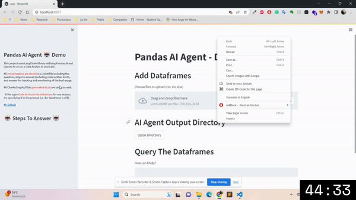
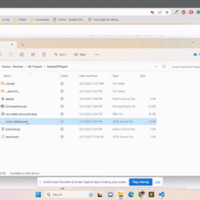
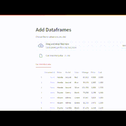
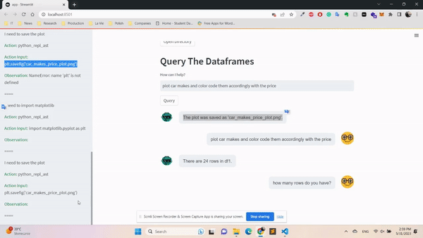
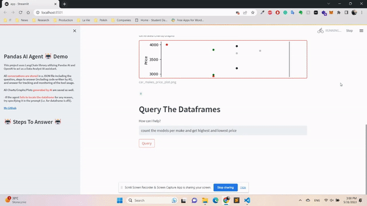

# PandasGPTAgent
Chat with your data utilizing powerful AI capabilities (OpenAI &amp; LangChain).



This tool utilizies powerful GPT model along with utilization of LangChain Agent to create a friendly UI to improve the experience and facilitate the usage of GPT models over various data files such as CSV, XLSX, or XLS.

This tool acts as a prototype to demonstrate the capabilities of what can be implemented which can be integrated/embedded into exisitng systems. 

This tool is the first UI prototype created for any Pandas Agent available for public.

View the tool UI components from [here]().
<br>

#### Abilities:
* Query your data in plain language.
* Facilitates and performs many Data Analysis related tasks.
* Create plots/graphs/charts.
* Accepts multiple files.
* Conversations are stored including (Question, Steps to Produce, and Answer)

<br>

| Conversation History      | Handle multiple files | Visualize data through various plots     | Inspect Model's Steps To Answer |
|    :----:   |    :----:   |    :----:   |    :----:   |
|       |        |  |   |


#### Requirements:
* Open AI API Key:  [Acquired Here](https://platform.openai.com/account/api-keys).
* Installation of the following libraries:

      pip install langchain
      pip install openai
      pip install streamlit
      pip install streamlit-image-select
<br>

#### Access Previous Conversations:

When accessing the convo_history.json file, the conversations shall be stored in the following format:

```json
    "DATE_TIME_STAMP": [
            {
                "Question": "",
                "Answer": "",
                "Steps": ""
            }
        ]
```

All generated Charts/Graphs/Plots are stored in the project base directory (Agent Working Directory).
<br>

#### Usage:
When using or modifying this tool do always give appropriate credit.

<br>

#### References:
* [LangChain Dataframe Agent](https://python.langchain.com/en/latest/modules/agents/toolkits/examples/pandas.html)
* [Open AI Model](https://platform.openai.com/)
* [StreamLit Python](https://docs.streamlit.io/)
* [Pandas AI Library](https://python.langchain.com/en/latest/modules/agents/toolkits/examples/pandas.html)
